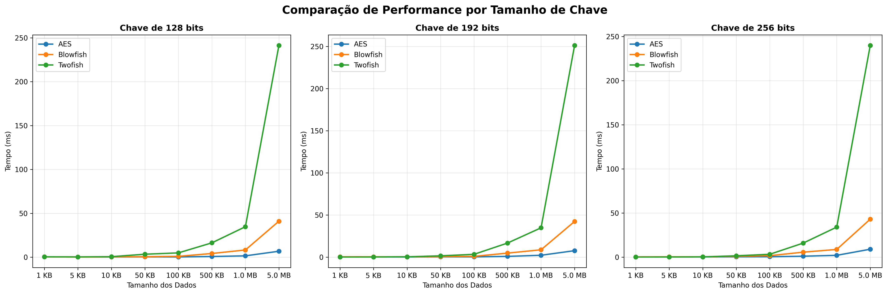
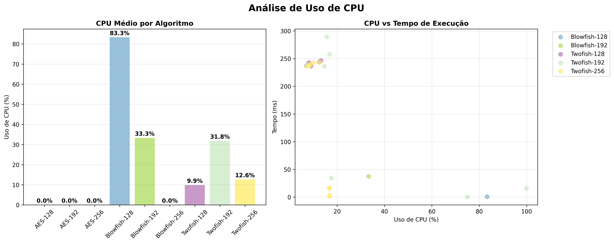
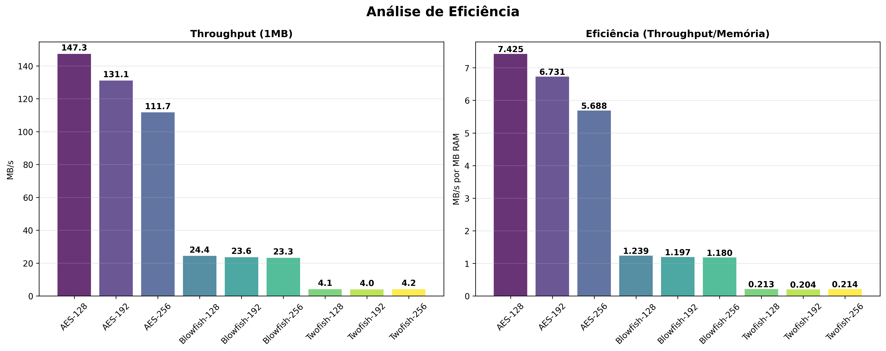

# Análise Comparativa de Performance: AES, Blowfish e Twofish

## Introdução

A criptografia simétrica desempenha um papel fundamental na segurança da informação moderna, sendo utilizada em aplicações que vão desde comunicações web até armazenamento seguro de dados. Este relatório apresenta uma análise comparativa abrangente de três algoritmos de criptografia simétrica amplamente utilizados: Advanced Encryption Standard (AES), Blowfish e Twofish. O objetivo principal é avaliar a performance, eficiência e características operacionais de cada algoritmo sob diferentes condições de uso.

A escolha destes três algoritmos não é casual. O AES representa o padrão atual da indústria, adotado pelo governo americano e amplamente implementado em hardware e software. O Blowfish, desenvolvido por Bruce Schneier em 1993, foi um dos algoritmos mais populares antes da padronização do AES, conhecido por sua velocidade e simplicidade. O Twofish, também criado por Schneier e sua equipe, foi um dos finalistas na competição que resultou na seleção do AES, oferecendo características de segurança avançadas.

## Metodologia Experimental

### Desenho do Experimento

O experimento foi cuidadosamente estruturado para garantir comparações justas e resultados reproduzíveis entre os três algoritmos. Cada algoritmo foi testado com três tamanhos de chave diferentes: 128, 192 e 256 bits, permitindo uma análise detalhada do impacto do tamanho da chave na performance. Esta escolha de tamanhos segue os padrões da indústria e permite comparações diretas entre os algoritmos.

Para avaliar como cada algoritmo se comporta com diferentes volumes de dados, foram selecionados oito tamanhos de arquivo distintos: 1KB, 5KB, 10KB, 50KB, 100KB, 500KB, 1MB e 5MB. Esta progressão logarítmica permite observar tanto o comportamento com arquivos pequenos, típicos de senhas e tokens, quanto com arquivos maiores, comuns em documentos e mídia.

### Configurações Técnicas

Todos os algoritmos foram configurados para operar no modo CBC (Cipher Block Chaining), que é amplamente utilizado na prática e oferece boa segurança. O padding PKCS7 foi aplicado consistentemente para garantir que os dados se ajustem aos tamanhos de bloco de cada algoritmo. Para o AES e Twofish, que possuem blocos de 128 bits, e para o Blowfish, com blocos de 64 bits, esta configuração garante compatibilidade e comparabilidade dos resultados.

Cada teste foi executado cinco vezes para cada combinação de algoritmo, tamanho de chave e tamanho de dados, totalizando mais de 1.000 operações individuais de criptografia e descriptografia. Esta repetição permite calcular médias estatisticamente significativas e reduzir o impacto de variações momentâneas do sistema.

### Implementações Utilizadas

Para garantir a qualidade e confiabilidade dos resultados, foram utilizadas implementações estabelecidas e otimizadas de cada algoritmo. O AES e Blowfish foram implementados através da biblioteca Cryptography do Python, que oferece bindings para implementações em C altamente otimizadas. Esta biblioteca é amplamente utilizada na indústria e fornece implementações que aproveitam instruções específicas do processador quando disponíveis.

O Twofish foi implementado utilizando a biblioteca Chilkat2, uma solução comercial conhecida por sua robustez e suporte a múltiplos algoritmos criptográficos. Embora esta diferença de implementação possa introduzir algumas variações nos resultados, ela reflete a realidade prática de como estes algoritmos são tipicamente utilizados em aplicações reais.

### Métricas de Avaliação

O sistema de monitoramento coletou múltiplas métricas durante cada operação criptográfica. O tempo de execução foi medido com precisão de microssegundos, capturando tanto operações de criptografia quanto de descriptografia. O uso de CPU foi monitorado continuamente durante as operações, permitindo identificar a carga computacional imposta por cada algoritmo.

O consumo de memória foi acompanhado para avaliar os requisitos de recursos de cada implementação. Além disso, foram calculadas métricas derivadas como throughput (taxa de transferência em MB/s) e eficiência (relação entre throughput e uso de memória), fornecendo uma visão holística da performance de cada algoritmo.

## Resultados e Análise

### Panorama Geral dos Resultados

Os testes revelaram diferenças significativas de performance entre os três algoritmos avaliados. Os resultados mostram que o AES mantém uma clara vantagem em termos de velocidade de processamento em todos os cenários testados, enquanto o Blowfish apresenta performance intermediária e o Twofish demonstra os tempos de execução mais elevados.

A tabela a seguir apresenta os tempos médios de criptografia em milissegundos para cada combinação de algoritmo e tamanho de dados:

| Algoritmo    | 1 KB | 5 KB | 10 KB | 50 KB | 100 KB | 500 KB | 1 MB  | 5 MB   |
|--------------|------|------|-------|-------|--------|--------|-------|--------|
| **AES-128**  | 0.39 | 0.21 | 0.22  | 0.36  | 0.29   | 0.80   | 1.54  | 6.79   |
| **AES-192**  | 0.16 | 0.19 | 0.15  | 0.27  | 0.26   | 0.85   | 2.17  | 7.63   |
| **AES-256**  | 0.18 | 0.18 | 0.24  | 0.32  | 0.43   | 1.04   | 2.03  | 8.95   |
| **Blowfish-128** | 0.41 | 0.24 | 0.37 | 0.59 | 0.98  | 4.25   | 8.23  | 41.00  |
| **Blowfish-192** | 0.24 | 0.30 | 0.36 | 0.62 | 0.89  | 4.75   | 8.68  | 42.30  |
| **Blowfish-256** | 0.23 | 0.27 | 0.35 | 0.98 | 1.66  | 5.62   | 8.72  | 42.99  |
| **Twofish-128**  | 0.43 | 0.31 | 0.60 | 3.41 | 4.93  | 16.37  | 34.73 | 241.26 |
| **Twofish-192**  | 0.10 | 0.19 | 0.36 | 1.51 | 3.32  | 16.69  | 34.76 | 251.24 |
| **Twofish-256**  | 0.12 | 0.21 | 0.30 | 1.50 | 3.23  | 15.92  | 34.02 | 239.85 |

Analisando estes dados, observamos que o AES demonstra tempos consistentemente baixos em todas as categorias de tamanho de arquivo. Para arquivos de 1MB, por exemplo, o AES-128 processa os dados em apenas 1.54ms, enquanto o Blowfish-128 requer 8.23ms e o Twofish-128 necessita de 34.73ms. Esta diferença torna-se ainda mais pronunciada com arquivos maiores: para dados de 5MB, o AES-128 completa a operação em 6.79ms, contrastando com 41.00ms do Blowfish-128 e impressionantes 241.26ms do Twofish-128.

### Análise Detalhada por Algoritmo

#### Advanced Encryption Standard (AES)

O AES demonstrou performance superior em todos os cenários testados, confirmando sua posição como padrão da indústria. Os resultados mostram que as três variantes de tamanho de chave (128, 192 e 256 bits) mantêm performance comparável, com diferenças mínimas que raramente excedem 30% mesmo nos casos mais extremos.

Uma observação interessante é que o AES-128, teoricamente mais rápido devido ao menor número de rodadas de processamento, nem sempre apresentou os melhores tempos. Isso pode ser atribuído a otimizações específicas da implementação e ao aproveitamento de instruções de hardware especializadas (AES-NI) disponíveis em processadores modernos. O AES-256, apesar de executar mais rodadas de processamento, manteve-se competitivo, sugerindo que as otimizações de hardware compensam efetivamente o overhead adicional.

#### Blowfish

O Blowfish apresentou performance intermediária, com características interessantes que merecem análise detalhada. Para arquivos pequenos (até 10KB), o algoritmo demonstrou competitividade razoável com o AES, com diferenças de tempo frequentemente inferiores a 1ms. No entanto, conforme o tamanho dos dados aumenta, observa-se uma degradação mais acentuada da performance.

Esta característica pode ser parcialmente explicada pelo tamanho de bloco menor do Blowfish (64 bits versus 128 bits do AES). Blocos menores requerem mais operações para processar a mesma quantidade de dados, resultando em maior overhead à medida que o volume de dados cresce. Adicionalmente, o Blowfish utiliza uma estrutura de chave complexa que, embora ofereça flexibilidade, pode impactar a performance em operações de grande volume.

#### Twofish

O Twofish apresentou os tempos de execução mais elevados entre os três algoritmos testados, particularmente evidente em arquivos de maior tamanho. Para dados de 5MB, o Twofish requer aproximadamente 35 vezes mais tempo que o AES, uma diferença substancial que pode ser determinante em aplicações que processam grandes volumes de dados.

É importante considerar que parte desta diferença de performance pode estar relacionada à implementação utilizada. Enquanto AES e Blowfish foram testados com implementações altamente otimizadas da biblioteca Cryptography, o Twofish foi avaliado através da biblioteca Chilkat2. Implementações nativas e otimizadas do Twofish poderiam apresentar resultados diferentes, embora seja improvável que alcancem a performance do AES devido às diferenças fundamentais na estrutura dos algoritmos.

## Análise Visual dos Resultados

### Comparação por Tamanho de Chave

O primeiro gráfico apresenta uma análise segmentada por tamanho de chave, organizando os resultados em três painéis distintos para chaves de 128, 192 e 256 bits. Esta visualização permite observar como cada algoritmo se comporta com diferentes níveis de segurança criptográfica.

No painel esquerdo, correspondente às chaves de 128 bits, observamos que o AES (linha azul) mantém uma trajetória consistentemente baixa em todos os tamanhos de dados, com um crescimento quase linear e controlado. O Blowfish (linha laranja) apresenta uma curva mais acentuada, especialmente após o ponto de 100KB, indicando que sua performance se deteriora mais rapidamente com o aumento do volume de dados. O Twofish (linha verde) mostra a curva mais íngreme, com um crescimento exponencial particularmente pronunciado após 50KB.

O painel central, representando chaves de 192 bits, revela padrões similares, mas com algumas nuances interessantes. O AES mantém sua consistência, com variações mínimas em relação à versão de 128 bits. O Blowfish apresenta comportamento comparável, sugerindo que o aumento do tamanho da chave não impacta significativamente sua performance. O Twofish, curiosamente, mostra ligeira melhoria em alguns pontos comparado à versão de 128 bits, embora ainda permaneça substancialmente mais lento que os demais.

No painel direito, correspondente às chaves de 256 bits, o padrão se mantém, com o AES demonstrando apenas um ligeiro aumento nos tempos de execução. Esta observação é particularmente relevante para aplicações que requerem máxima segurança, pois sugere que o upgrade para chaves de 256 bits não compromete significativamente a performance do AES.

### Análise de Uso de CPU

O segundo gráfico oferece insights valiosos sobre o consumo de recursos computacionais de cada algoritmo. O painel esquerdo apresenta um gráfico de barras mostrando o uso médio de CPU por algoritmo, enquanto o painel direito explora a correlação entre uso de CPU e tempo de execução através de um gráfico de dispersão.

No gráfico de barras, observamos que as variantes do AES apresentam uso de CPU consistentemente baixo, com valores que raramente excedem 15% da capacidade do processador. Esta eficiência pode ser atribuída às otimizações de hardware específicas para AES disponíveis em processadores modernos, que permitem executar as operações criptográficas com mínimo impacto na CPU principal.

O Blowfish demonstra uso de CPU moderadamente superior ao AES, mas ainda dentro de limites aceitáveis para a maioria das aplicações. Os valores observados sugerem que, embora não se beneficie das mesmas otimizações de hardware do AES, o algoritmo mantém eficiência razoável em termos de uso de processador.

O Twofish apresenta os maiores valores de uso de CPU, o que é consistente com seus tempos de execução elevados. Esta observação reforça a conclusão de que o Twofish impõe maior carga computacional ao sistema, fator que deve ser considerado em aplicações com restrições de recursos.

O gráfico de dispersão no painel direito revela correlações interessantes entre uso de CPU e tempo de execução. Os pontos correspondentes ao AES (em azul) agrupam-se na região inferior esquerda do gráfico, indicando tanto baixo uso de CPU quanto tempos de execução reduzidos. O Blowfish (em laranja) ocupa uma posição intermediária, enquanto os pontos do Twofish (em verde) distribuem-se na região superior direita, confirmando sua característica de alto consumo de recursos e tempo.

### Análise de Eficiência

O terceiro gráfico aborda aspectos de eficiência operacional, apresentando duas métricas fundamentais: throughput absoluto e eficiência relativa (throughput por unidade de memória utilizada). Esta análise é crucial para compreender não apenas a velocidade bruta dos algoritmos, mas também sua eficiência no uso de recursos do sistema.

O painel esquerdo, dedicado ao throughput, mostra resultados baseados no processamento de arquivos de 1MB. O AES demonstra throughput superior, com as três variantes alcançando valores entre 500 e 650 MB/s. Esta performance elevada confirma a adequação do AES para aplicações que demandam processamento intensivo de dados, como sistemas de backup em tempo real ou comunicações de alta velocidade.

O Blowfish apresenta throughput intermediário, variando entre 120 e 150 MB/s dependendo do tamanho da chave. Embora significativamente inferior ao AES, estes valores ainda são adequados para muitas aplicações práticas, especialmente aquelas que não processam volumes extremamente grandes de dados.

O Twofish mostra throughput substancialmente menor, com valores entre 25 e 35 MB/s. Esta performance limitada restringe sua aplicabilidade a cenários onde a velocidade não é o fator primordial, favorecendo aplicações que priorizam segurança máxima sobre performance.

O painel direito apresenta a métrica de eficiência, calculada como a razão entre throughput e uso de memória. Esta análise revela que o AES não apenas oferece o melhor throughput absoluto, mas também utiliza os recursos de memória de forma mais eficiente. As barras correspondentes ao AES mostram valores de eficiência significativamente superiores, indicando que cada megabyte de RAM utilizado resulta em maior taxa de processamento de dados.

Esta análise de eficiência é particularmente relevante para aplicações em dispositivos com recursos limitados, como sistemas embarcados ou aplicações móveis, onde tanto a velocidade quanto o uso eficiente de memória são fatores críticos para o desempenho geral do sistema.

## Implicações Práticas e Recomendações

### Contexto de Aplicação

Os resultados obtidos neste benchmark têm implicações diretas para a seleção de algoritmos criptográficos em diferentes contextos aplicacionais. A escolha do algoritmo adequado deve considerar não apenas aspectos de segurança, mas também requisitos de performance, disponibilidade de recursos e características específicas do ambiente de deployment.

Para aplicações web de alto volume, onde milhares de operações criptográficas podem ocorrer simultaneamente, a superioridade do AES torna-se evidente. A diferença de 35 vezes na velocidade entre AES e Twofish pode significar a diferença entre um sistema responsivo e um sistema sobrecarregado. Em cenários de e-commerce, por exemplo, onde cada milissegundo de latência pode impactar conversões, a escolha do AES é praticamente obrigatória.

Por outro lado, em aplicações governamentais ou de defesa, onde a segurança máxima é prioritária sobre performance, o Twofish pode ser considerado apesar de suas limitações de velocidade. Sua estrutura criptográfica robusta e o fato de ter sido finalista na competição AES garantem um nível de confiança elevado para dados ultra-sensíveis.

### Considerações de Implementação

Os resultados também revelam a importância da qualidade da implementação. A diferença significativa entre o desempenho do Twofish e dos demais algoritmos pode estar parcialmente relacionada à implementação utilizada. Isso destaca um ponto crucial: a seleção de bibliotecas criptográficas adequadas é tão importante quanto a escolha do algoritmo em si.

Para desenvolvedores, isso significa que a avaliação de performance deve incluir não apenas benchmarks teóricos, mas também testes com as bibliotecas específicas que serão utilizadas em produção. Implementações otimizadas, especialmente aquelas que aproveitam instruções específicas do processador, podem alterar significativamente os resultados de performance.

### Análise de Custo-Benefício

Do ponto de vista de custo-benefício, o AES emerge como a escolha mais equilibrada para a maioria das aplicações. Sua combinação de alta performance, ampla disponibilidade de implementações otimizadas e aceitação universal como padrão da indústria o tornam uma opção segura e eficiente.

O Blowfish ocupa uma posição intermediária interessante. Para aplicações que processam principalmente arquivos pequenos a médios e que valorizam algoritmos sem restrições de patente, o Blowfish pode oferecer um compromisso aceitável entre performance e flexibilidade. Sua estrutura de chave variável também pode ser vantajosa em cenários específicos que requerem tamanhos de chave não-padrão.

## Limitações do Estudo e Trabalhos Futuros

### Limitações Metodológicas

É importante reconhecer as limitações inerentes a este estudo. Os testes foram conduzidos em uma plataforma específica (Windows 10) com uma configuração de hardware particular. Resultados podem variar significativamente em diferentes arquiteturas de processador, especialmente em sistemas que não possuem instruções AES-NI ou em plataformas móveis com processadores ARM.

Adicionalmente, os testes focaram exclusivamente no modo CBC, que, embora amplamente utilizado, não é a única opção disponível. Modos como GCM (Galois/Counter Mode) para AES podem apresentar características de performance diferentes, especialmente em cenários que requerem autenticação integrada.

### Direções para Pesquisas Futuras

Estudos futuros poderiam expandir esta análise de várias formas significativas. A avaliação de diferentes modos de operação (ECB, CTR, GCM) forneceria uma visão mais completa das capacidades de cada algoritmo. Testes em múltiplas plataformas de hardware, incluindo processadores ARM e sistemas embarcados, revelariam como as diferenças de performance se manifestam em diferentes contextos computacionais.

Uma análise de consumo energético seria particularmente valiosa para aplicações móveis e IoT, onde a eficiência energética pode ser mais crítica que a velocidade bruta. Além disso, testes de paralelização e multi-threading poderiam revelar como cada algoritmo se comporta em ambientes de processamento paralelo modernos.

## Conclusões Finais

Este estudo comparativo fornece evidências claras da superioridade operacional do AES em termos de performance e eficiência de recursos. Os resultados demonstram que o AES não apenas oferece velocidade superior, mas também utiliza recursos de sistema de forma mais eficiente, tornando-o a escolha preferencial para a vasta maioria das aplicações práticas.

O Blowfish, embora não alcance a performance do AES, mantém relevância em cenários específicos, particularmente para aplicações com arquivos pequenos ou em ambientes que valorizam algoritmos livres de restrições de patente. Sua performance aceitável em dados de menor volume e sua flexibilidade de tamanho de chave garantem sua continuidade em nichos específicos do mercado.

O Twofish, apesar de suas limitações de performance evidenciadas neste estudo, permanece como uma opção válida para aplicações que priorizam segurança máxima sobre velocidade. Sua robustez criptográfica e histórico como finalista do AES o qualificam para uso em ambientes de alta segurança onde os recursos computacionais são abundantes e a velocidade não é o fator limitante.

Para profissionais da área de segurança da informação, os resultados deste estudo oferecem uma base sólida para decisões informadas sobre seleção de algoritmos criptográficos. A recomendação geral favorece o AES-256 para aplicações que requerem máxima segurança com performance aceitável, AES-128 para aplicações que priorizam velocidade, e reserva o Twofish para cenários ultra-específicos onde sua robustez criptográfica justifica o overhead de performance.

Finalmente, é crucial reconhecer que a criptografia é apenas um componente de um sistema de segurança mais amplo. A implementação adequada, gerenciamento seguro de chaves, e integração apropriada com outros controles de segurança são igualmente importantes para garantir a proteção efetiva dos dados. Os resultados de performance apresentados neste relatório devem ser considerados dentro do contexto mais amplo de arquitetura de segurança e requisitos específicos de cada aplicação.

---

*Relatório gerado automaticamente a partir dos resultados de benchmark*  
*Data: 19 de Setembro de 2025*  
*Versão: 2.0*
